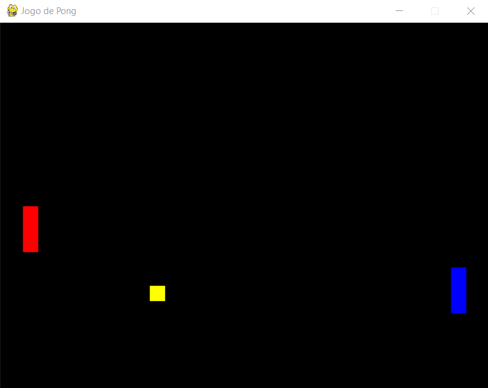

# JOGO DO PONG
🎮JOGO DO PONG COM INTERFACE GRAFICA.

  

  
> IMAGEM ILUSTRATIVA!

## 😎DESCRIÇÃO:
Bem-vindo ao projeto "Jogo do Pong"! Este repositório contém implementações em Python e C# do clássico jogo Pong. O Pong é um dos primeiros jogos eletrônicos da história e foi lançado em 1972 pela Atari. É um jogo de esporte simples, onde dois jogadores controlam barras verticais em lados opostos da tela, tentando acertar uma bola e enviá-la para o campo do adversário.

O objetivo deste projeto é oferecer diferentes implementações do Pong em duas linguagens de programação populares. Aqui estão as principais funcionalidades implementadas em cada versão:

1. **Modo de jogo para dois jogadores:** Você pode jogar contra um amigo, cada um controlando uma barra com suas teclas correspondentes.
2. **Movimento suave da barra:** As barras respondem de forma suave aos comandos do jogador, permitindo um controle preciso durante o jogo.
3. **Colisões realistas:** A bola rebaterá nas barras e nas paredes de forma realista, seguindo as leis da física.
4. **Sistema de pontuação:** Mantenha o controle da pontuação de cada jogador à medida que a bola passa pela barra adversária.
5. **Efeitos sonoros:** Desfrute de efeitos sonoros empolgantes que aprimoram a experiência de jogo.

