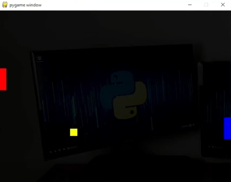

# JOGO DO PONG GL
🎮JOGO DO PONG COM INTERFACE GRAFICA.

 <br>

## DESCRIÇÃO:
Este programa utiliza a biblioteca Pygame e OpenGL para criar um jogo simples de Pong, um jogo de arcade clássico de dois jogadores. Aqui estão as principais funcionalidades do código:

- Define as dimensões da janela do jogo (640x480 pixels).
- Inicializa as variáveis relacionadas à posição e velocidade da bola, bem como à posição dos jogadores.
- Implementa funções para calcular as coordenadas X dos jogadores e as dimensões dos jogadores.
- Atualiza a lógica do jogo, movendo a bola, verificando colisões com os jogadores e as bordas da tela, e atualizando as posições dos jogadores com base nas teclas pressionadas.
- Implementa funções para desenhar retângulos coloridos na tela, representando a bola e os jogadores.
- Configura o ambiente OpenGL e a matriz de projeção para renderizar os elementos na tela.
- Utiliza um loop principal para continuamente atualizar e desenhar o estado do jogo.

O jogo é controlado pelos seguintes comandos do teclado:
- Jogador 1 (vermelho): Teclas "W" para cima e "S" para baixo.
- Jogador 2 (azul): Teclas de seta para cima e para baixo.

O jogo continua indefinidamente no loop principal, sendo atualizado e renderizado a cada iteração.

## EXECUTANDO O JOGO:
1. **Instalando as dependências:**
   - Antes de executar o jogo, certifique-se de instalar todas as dependências necessárias. No terminal, execute o seguinte comando para instalar as dependências listadas no arquivo `requirements.txt` em `CODIGO`:
   ```bash
   pip install -r requirements.txt
   ```

2. **Inicie o Jogo:**
   - Inicie com o seguinte comando:
   ```bash
   python CODIGO.py
   ```

3. **Jogando:**
   1. O jogo da Pong será iniciado em uma janela.
   2. Use as teclas 'W' e 'S' para mover o jogador 1 para cima e para baixo, respectivamente.
   3. Use as teclas de seta para cima e para baixo para mover o jogador 2 para cima e para baixo, respectivamente.

## NÃO SABE?
- Entendemos que para manipular arquivos em muitas linguagens e tecnologias, é necessário possuir conhecimento nessas áreas. Para auxiliar nesse aprendizado, oferecemos cursos gratuitos disponíveis:
* [CURSO DE PYGAME](https://github.com/VILHALVA/CURSO-DE-PYGAME)
* [CURSO DE PYTHON](https://github.com/VILHALVA/CURSO-DE-PYTHON)
* [CONFIRA MAIS CURSOS](https://github.com/VILHALVA?tab=repositories&q=+topic:CURSO)

## CREDITOS:
- [PROJETO CRIADO PELO "oprogramadorreal"](https://github.com/oprogramadorreal/Prong.py)
- [VEJA O VIDEO DESSE PROJETO](https://youtu.be/Is3q5Bbs9zA?si=a4ml_4csCqSN-omV)
- [PROJETO EDITADO PELO VILHALVA](https://github.com/VILHALVA)


